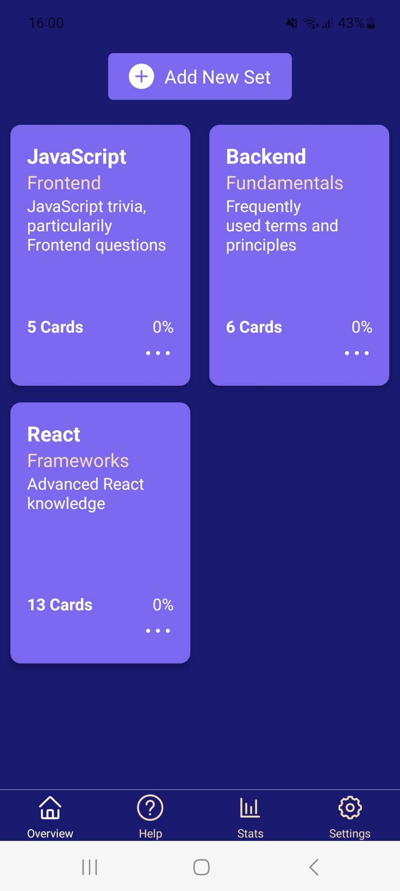
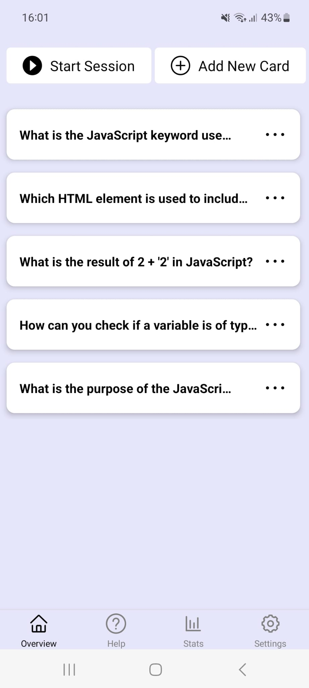
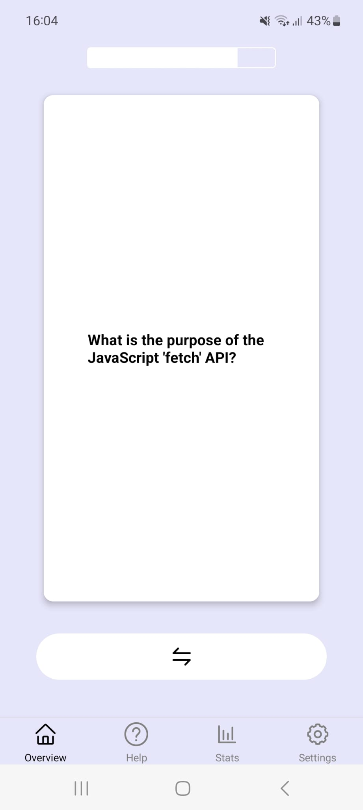

# DOMemory React-Native Application

Welcome to the README for the DOMemory React-Native application! This application serves as an index card system where users can create, update, and review cards for various topics. Users can then test themselves through session modes, with their progress being tracked over time.

## Screenshots

Below are the screenshots to give you a visual overview of the application:

### Set Overview (Dark Mode)

- **Description**: This image showcases all the card sets, which contain relevant cards for different topics. You can add new card sets or update existing ones.

### Card Overview (Light Mode)

- **Description**: Here, you can see all the cards within a selected set. Users can add new cards or modify existing ones as needed.

### Session Mode

- **Description**: The session mode is where the real learning happens! Users can test themselves by answering questions on each card in the set. Initially, only the question is visible. Once they feel confident about their answer, they can flip the card to reveal the answer. Based on their response, they can categorize the card as "correctly answered" or "wrongly answered".

### Score and Stats Page
- **Description**: After completing a session, users are presented with their score. They can also track their progress over time via the stats page.

### Light and Dark Mode
- **Description**: For user convenience, the application offers both light and dark modes.

## Getting Started
[Provide instructions on how to install and run the application, any prerequisites, etc.]

## Features
- Feature 1
- Feature 2
- ...

## Contributing
[Guidelines for contributing to the project]

## License
[Information about the project's license]
